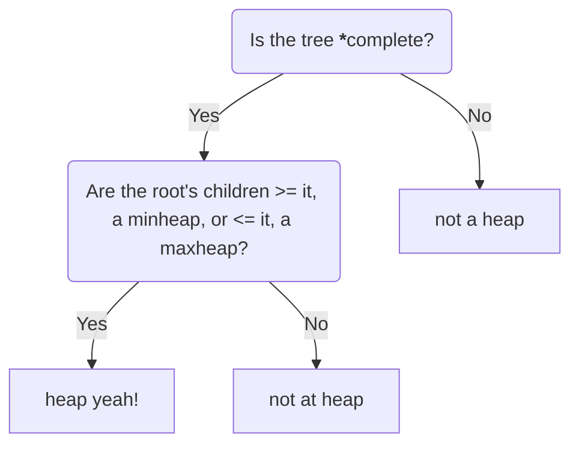

## Definition:

Heaps are a binary tree with a structural property in which all heaps are a complete binary tree (when coded we dont use linked lists with left and right pointers, rather we trace through an array and manipulating the array as if it was a complete binary tree). Heaps must also have all of its nodes in a specific order, following the heap order property. <br>

What makes a heap, a heap? First, ask yourself this...

<!--more-->


* All of the levels of the tree must be filled completely except maybe the last one. <br>
    |> must have the **left-most** nodes **always** filled.

---


## Growing and Shrinking 
When we insert or delete from a heap it is important to remember to not violate any of the heap's properties when manipulating the tree.
If we are inserting something into the tree it is important to note that we can only insert a node at the bottom(lowest) left most position in the tree.
Once we insert something into the tree you have to check and verify that it follows the heap code.

```
Here is a sample minheap 

        (56)
        /  \
      (67) (98)
      /
    (78)

insert(45)

        (56)
        /  \
      (67) (98)
      /  \
    (78) (45) <-- lowest left most position
    
Now that we inserted our value or key, since the leaf node, (45), is smaller than its parent and root,
it violates the heap code and we would have to **percolate up** swap the child with its parent until 
it satifies the minheap property!

        (56)
        /  \
      (45) (98)     *swaps*
      /  \
    (78) (67)
    
        (45)        *swaps*
        /  \
      (56) (98)
      /  \
    (78) (67)
    
Yay! It's a minheap again!
We continued swapping until the parent is smaller than the key we are percolating upwards. 

```
//

---
From what we just learned, the only position we can insert a key is at a specific location to maintain the heaps structure and properties.<br>
What if we want to shrink our heap? a.k.a, delete it. 

```
Deletion example with a maxheap. 

        ( 340 )
        /      \
    (230)     (198)     
    /   \     /   \
(178) (167) (145) (190)

delete(root)    Note: with deletion, in order to maintain the heap structure we can only delete from 
                      the root, we are unable to delete a random value. Generally when you want to 
                      delete from a heap, it is always the root. Using this data structure you 
                      cannot delete some arbitrary value. 

        (  X  )     <----- *poof* deleted
        /      \
    (230)     (198)     
    /   \     /   \
(178) (167) (145) (190)


        (  X  )             *still want to follow the heap code, what should we do next?
        /      \
    (230)     (198)     
    /   \     /   \
(178) (167) (145) (190)


        ( 190 )             
        /      \
    (230)     (198)     
    /   \     /         <--- took lowest, left leaf and placed it at the root. 
(178) (167) (245) 

Now that we satisfied the first property, we move onto the second strucutral property and perform some swaps
to get the max value at the root.

        ( 230 )         *swaps* 
        /      \
    (190)     (198)     
    /   \     /   
(178) (167) (145) 

```
---

```

What if the children of the root are both the same? How can we figure out which path to take downwards?


```
This entire time we have been representing heaps as a complete binary tree however they are implemented using an array. 

```
+--------------+
|12|56|23|45|89|
+--------------+
 0  1  2  3  4

Size: 4
Capacity: 5

Pictorially, array-to-tree conversion looks like this

                (12)  <--- index 0
                /  \
index 1 --->  (56) (23) <--- index 2
              /  \
index 3 --->(45) (89) <--- index 4
```
These are the functions when figuring out the location of the parent, right and left child. 
```
Parent(i): (i - 1) / 2          
left_child(i): (i * 2) + 1
right_child(i): (i * 2) + 2
```
---

```
**Special Function
BRMNLN(bottom right most nonleaf node): The parent of size - 1 => (i - 2) / 2

```

## Heapsort and Heapify 
T

## Applications 


## Time and Space Complexity
### Height
> "We define the height of a node in a tree to be the number of edges on the longest simple downward path from the node to a leaf, and we define the height of the tree to be the height of its >root. Since a heap of n elements is based on a complete binary tree, its height is (lg n). We shall see that the basic operations on heaps run in time at most proportional >to the height of the tree and thus take O(lg n) time."

>[source](http://net.pku.edu.cn/~course/cs101/2007/resource/Intro2Algorithm/book6/chap07.htm)

To visually prove this, here's a sample **complete** tree. 
```
        (46)
        /  \
      (57) (88)
      /
    (68)
    
Looking at the tree, it has 2 branches down from the root, the height is 2.
Mathematically when plugging in the number of nodes, n, into log(base 2)n
we get the value CEIL log(base2)4 = 2 since 2^2 = 4.
The height will always be log2(n) or (ceilLog(n+1) - 1) since the tree
is complete and can never devolve into a linked list. 
```

### TLDR;


### Glossary and Sources
>[Traversals](http://robin-thomas.github.io/min-heap/)

