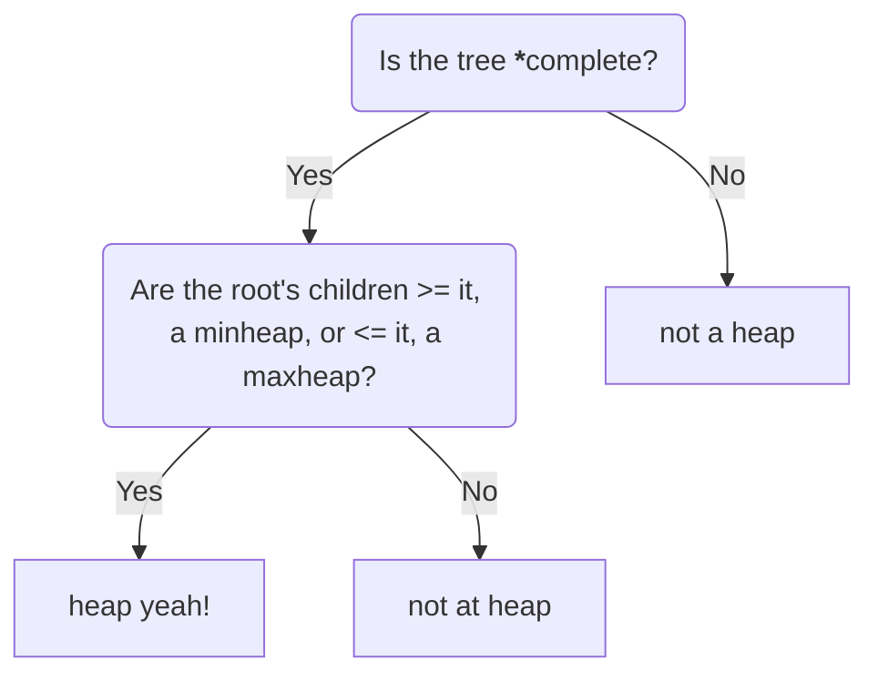

## Definition:

Heaps are a binary tree with a structural property in which all heaps are a complete binary tree (when coded we dont use linked lists with left and right pointers, rather we trace through an array and manipulating the array as if it was a complete binary tree. Heaps also must also have all of its nodes in a specific order, following the heap order property. <br>

What makes a heap, a heap? Firstly, ask yourself this 


* All of the levels of the tree must be filled completely except maybe the last one. <br>
    |> must have the **left-most** nodes **always** filled.

---


<!--more-->


## Growing and Shrinking 
When we insert or delete from a heap it is important to remember to not violate any of the heap's properties when manipulating the tree.<br>
If we are inserting something into the tree it is important to note that we can only insert a node at the bottom(lowest) left most position in the tree.<br>
Once we insert something into the tree you have to check and verify that it follows the heap code.

```
Here is a sample minheap 

        (56)
        /  \
      (67) (98)
      /
    (78)

insert(45)

        (56)
        /  \
      (67) (98)
      /  \
    (78) (45) <-- lowest left most position
    
Now that we inserted our value or key, since the leaf node, (45), is smaller than its parent and root,
it violates the heap code and we would have to **percolate up** swap the child with its parent until it satifies the
minheap property!

        (56)
        /  \
      (45) (98)     *swaps*
      /  \
    (78) (67)
    
        (45)        *swaps*
        /  \
      (56) (98)
      /  \
    (78) (67)
    
Yay! It's a minheap again!
We continued swapping until the parent was smaller than the key we are percolating upwards. 

```
With minheaps you can imagine that you have a lot of responsibilites on your hands. Now separate your tasks from 
least important to most important. The larger numerical values signifying the more significant tasks you want to bring forward in order of importance whereas the small,
quick tasks you can push back (closer to the root) to be completed later. 

## Applications 

## Heapsort and Heapify 

## Time and Space Complexity

## Lets code it up!

### Glossary and Sources
