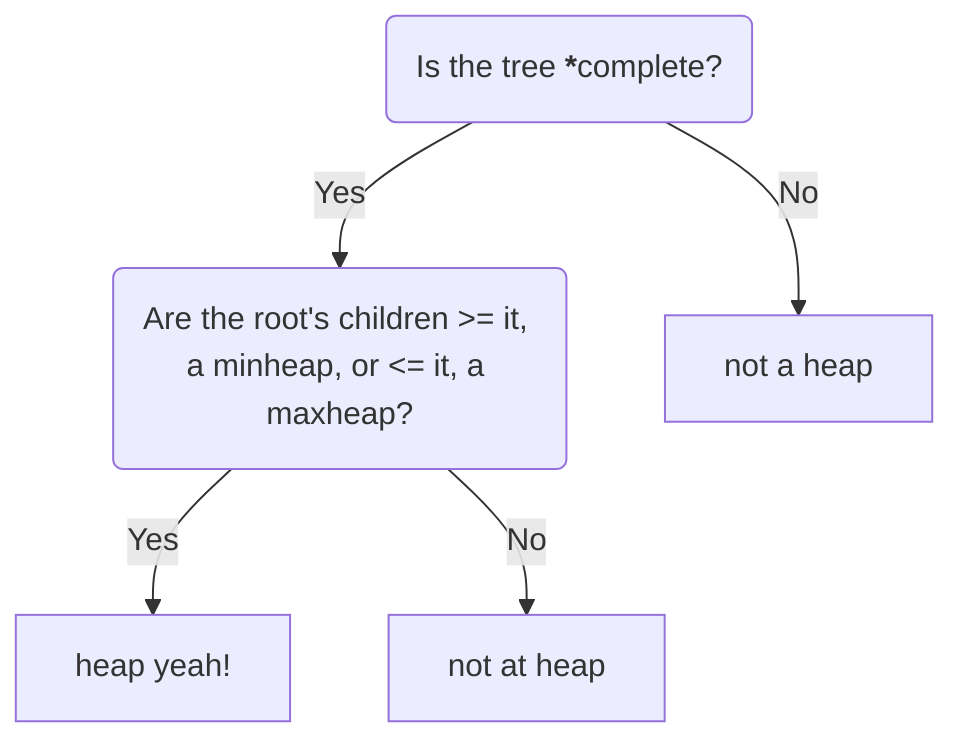

## Definition:

Heaps are a binary tree with a structural property in which all heaps are a complete binary tree (when coded we dont use linked lists with left and right pointers, rather we trace through an array and manipulating the array as if it was a complete binary tree. Heaps also must also have all of its nodes in a specific order, following the heap order property.  

What makes a heap, a heap? Firstly, ask yourself this 

* All of the levels of the tree must be filled completely except maybe the last one.  
    |> must have the **left-most** nodes **always** filled.

---

<!--more-->

## Growing and Shrinking 

## Applications 

## Heapsort and Heapify 

## Time and Space Complexity

## Lets code it up!

### Glossary and Sources
