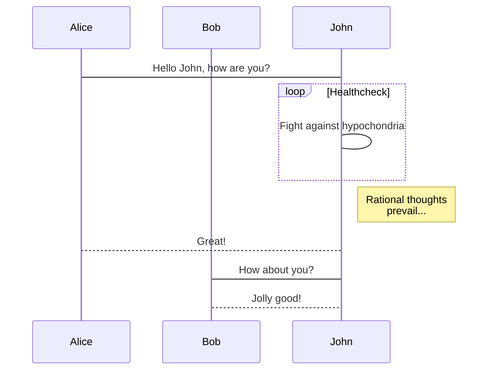
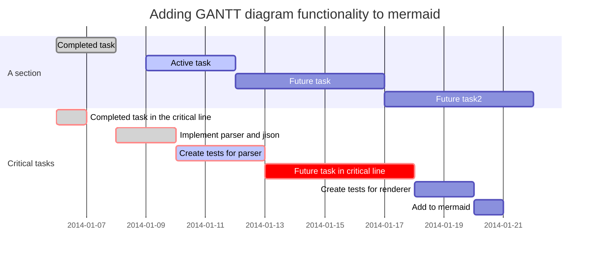

## Definition:

Heaps are a binary tree with a structural property in which all heaps are a complete binary tree (when coded we dont use linked lists with left and right pointers, rather we trace through an array and manipulating the array as if it was a complete binary tree. Heaps also must also have all of its nodes in a specific order. 

```mermaid
graph TD;
    Is the tree *complete?-->Yes;
    Is the tree *complete?-->No;
    Yes-->Is the root's children >= (min) or <= (max)?;
    No-->Not a heap;
    Is the root's children >= (min) or <= (max)?-->heap yeah!;
```
*: all of the levels of the tree must be filled completely except maybe the last one. <br>
    |> must have **left-most** nodes **always** filled.
---


<!--more-->

You need set `mermaid: true` in the _config.yml or the markdown's front matter to **enable** it.
{:.warning}

Generation of diagrams and flowcharts from text in a similar manner as markdown.

Ever wanted to simplify documentation and avoid heavy tools like Visio when explaining your code?

This is why [mermaid](https://mermaidjs.github.io/) was born, a simple markdown-like script language for generating charts from text via javascript.

## Flowchart

 ```mermaid
    graph TD;
        Hello-->Goodbye;
        Hello-->C;
        Goodbye-->D;
        C-->D;
    ```

[Documentation for Flowchart](https://mermaidjs.github.io/flowchart.html)

**markdown:**

    ```mermaid
    graph TD;
        Hello-->Goodbye;
        A-->C;
        B-->D;
        C-->D;
    ```

## Sequence Diagram



[Documentation for Sequence Diagram](https://mermaidjs.github.io/sequenceDiagram.html)

**markdown:**

    ```mermaid
    sequenceDiagram
        participant Alice
        participant Bob
        Alice->John: Hello John, how are you?
        loop Healthcheck
            John->John: Fight against hypochondria
        end
        Note right of John: Rational thoughts <br/>prevail...
        John-->Alice: Great!
        John->Bob: How about you?
        Bob-->John: Jolly good!
    ```

## Gant Diagrams



[Documentation for Gant Diagram](https://mermaidjs.github.io/gantt.html)

**markdown:**

    ```mermaid
    gantt
        dateFormat  YYYY-MM-DD
        title Adding GANTT diagram functionality to mermaid
        section A section
        Completed task            :done,    des1, 2014-01-06,2014-01-08
        Active task               :active,  des2, 2014-01-09, 3d
        Future task               :         des3, after des2, 5d
        Future task2              :         des4, after des3, 5d
        section Critical tasks
        Completed task in the critical line :crit, done, 2014-01-06,24h
        Implement parser and jison          :crit, done, after des1, 2d
        Create tests for parser             :crit, active, 3d
        Future task in critical line        :crit, 5d
        Create tests for renderer           :2d
        Add to mermaid
    ```
    Electroencephalography (EEG) is an electrophysiological monitoring method to record electrical activity of the brain. It is typically noninvasive, with the electrodes placed along the scalp, although invasive electrodes are sometimes used such as in electrocorticography. EEG measures voltage fluctuations resulting from ionic current within the neurons of the brain. In clinical contexts, EEG refers to the recording of the brain's spontaneous electrical activity over a period of time, as recorded from multiple electrodes placed on the scalp. Diagnostic applications generally focus either on event-related potentials or on the spectral content of EEG. The former investigates potential fluctuations time locked to an event like stimulus onset or button press. The latter analyses the type of neural oscillations (popularly called "brain waves") that can be observed in EEG signals in the frequency domain.


EEG is most often used to diagnose epilepsy, which causes abnormalities in EEG readings. It is also used to diagnose sleep disorders, depth of anesthesia, coma, encephalopathies, and brain death. EEG used to be a first-line method of diagnosis for tumors, stroke and other focal brain disorders, but this use has decreased with the advent of high-resolution anatomical imaging techniques such as magnetic resonance imaging (MRI) and computed tomography (CT). Despite limited spatial resolution, EEG continues to be a valuable tool for research and diagnosis. It is one of the few mobile techniques available and offers millisecond-range temporal resolution which is not possible with CT, PET or MRI.

Derivatives of the EEG technique include evoked potentials (EP), which involves averaging the EEG activity time-locked to the presentation of a stimulus of some sort (visual, somatosensory, or auditory). Event-related potentials (ERPs) refer to averaged EEG responses that are time-locked to more complex processing of stimuli; this technique is used in cognitive science, cognitive psychology, and psychophysiological research.